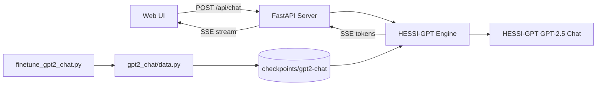

# Hessi-GPT (GPT-2.5)

**A decoder-only language model I wrote, trained, and shipped with a live streaming chat UI.**

[](https://github.com/HessiKz/)
[](https://www.python.org/)
[](https://pytorch.org/)
[](https://fastapi.tiangolo.com/)
[](https://hessikz.github.io/Hessi-GPT/)
[](LICENSE)

> **Portfolio summary:** Designed and implemented **HESSI-GPT (GPT-2.5)** end to end — transformer stack, chat fine-tuning, streaming inference, FastAPI SSE backend, and a custom industrial terminal UI. Live demo on GitHub Pages.

**Live demo:** [hessikz.github.io/Hessi-GPT](https://hessikz.github.io/Hessi-GPT/)

---

## Overview

**HESSI-GPT** is my personal GPT-2.5-class chat model: a decoder-only transformer written and iterated in this repo, chat-fine-tuned for multi-turn dialogue, and exposed through a real-time inference stack I built myself.

What you get in this repository:

- **Model work** — architecture, training path, chat formatting, and checkpoint-based generation for HESSI-GPT (GPT-2.5)
- **Streaming inference** — top-p sampling, stop sequences, multi-turn memory
- **FastAPI backend** — Server-Sent Events (SSE) for token-by-token output
- **Custom web UI** — industrial terminal with pipeline phases, architecture specs, and token telemetry
- **Static demo deploy** — GitHub Pages front-end for the public inference terminal

The research lineage includes a small JAX/Equinox minigpt-style training path; the production chat stack uses PyTorch and Hugging Face Transformers around the HESSI-GPT (GPT-2.5) chat checkpoint.

---

## What I Built

| Layer | Description |
|-------|-------------|
| **HESSI-GPT (GPT-2.5)** | Decoder-only LM designed, trained, and chat-tuned by me for conversational replies |
| **Fine-tuning pipeline** | Dataset loading, chat formatting (`User:` / `Assistant:`), Hugging Face `Trainer` loop |
| **Inference engine** | Checkpoint load/generate with streaming, stop sequences, and conversation history |
| **API server** | FastAPI + SSE at `/api/chat`, health and architecture endpoints |
| **Frontend** | Industrial-brutalist chat terminal with live pipeline phases and per-token metrics |
| **CLI** | `generate.py` for quick local testing without the UI |

---

## Architecture



**Model:** HESSI-GPT (GPT-2.5) · decoder-only · chat instruction-tuned · BPE tokenizer  
**Decoding:** Top-p (nucleus) sampling · repetition penalty · multi-turn prompt formatting

---

## Tech Stack

**ML / NLP:** PyTorch, Hugging Face Transformers, Datasets, Accelerate  
**Backend:** FastAPI, Uvicorn, Pydantic, SSE streaming  
**Frontend:** Vanilla HTML/CSS/JS (no framework)  
**Research path:** JAX/Equinox transformer (`src/minigpt/`)

---

## Quick Start

### 1. Clone and install

```bash
git clone https://github.com/HessiKz/Hessi-GPT.git
cd Hessi-GPT
python -m venv .venv
source .venv/bin/activate
pip install torch transformers datasets accelerate fastapi uvicorn pydantic
```

### 2. Train / fine-tune the HESSI-GPT (GPT-2.5) chat checkpoint

```bash
CUDA_VISIBLE_DEVICES="" python finetune_gpt2_chat.py --max-steps 60
```

Checkpoint output: `checkpoints/gpt2-chat/`

> **Note:** Large weight files are not committed (repo size). Run the training step above to produce a local chat checkpoint.

### 3. Chat from the CLI

```bash
python generate.py --prompt "Hello! How are you?" --max-tokens 80
```

### 4. Launch the web UI (local FastAPI stack)

```bash
./run_ui.sh
```

Open **http://127.0.0.1:8765**

The UI streams tokens in real time and shows pipeline phases: encode → decode → emit.

### 5. Public static demo

The GitHub Pages demo hosts the same terminal UI for **HESSI-GPT (GPT-2.5)** streaming inference:

- Demo: https://hessikz.github.io/Hessi-GPT/
- Source UI: `web/`

---

## API (local server)

| Endpoint | Method | Description |
|----------|--------|-------------|
| `/` | GET | Chat UI |
| `/api/health` | GET | Server and model status |
| `/api/architecture` | GET | Model spec and pipeline steps |
| `/api/chat` | POST | SSE streaming chat (`prompt`, `max_tokens`) |

**Example:**

```bash
curl -N -X POST http://127.0.0.1:8765/api/chat \
  -H "Content-Type: application/json" \
  -d '{"prompt":"Hello!","max_tokens":40}'
```

---

## Project Structure

```
Hessi-GPT/
├── finetune_gpt2_chat.py   # Chat fine-tuning entry point
├── generate.py             # CLI chat inference
├── engine.py               # HESSI-GPT streaming inference engine
├── server.py               # FastAPI + SSE server
├── run_ui.sh               # Start the chat UI
├── gpt2_chat/
│   ├── config.py           # Training & generation hyperparameters
│   ├── data.py             # Dataset loading and tokenization
│   └── formatting.py       # Chat prompt templates
├── web/                    # Chat UI (HTML, CSS, JS) + Pages demo
└── src/minigpt/            # JAX transformer research path
```

---

## Skills Demonstrated

- **Language model engineering** — designing and shipping HESSI-GPT (GPT-2.5) as a chat LM
- **LLM fine-tuning** — instruction-style chat formatting, causal LM training, checkpoint management
- **Real-time inference** — streaming generation, stop sequences, conversation state
- **Backend engineering** — REST + SSE APIs, async request handling, model warm-up on startup
- **Frontend UX** — streaming text rendering, live telemetry, accessible dark UI
- **ML systems** — CPU/GPU device handling, deployment paths (local, Docker, GitHub Pages demo)

---

## Resume Bullet (copy-paste)

> Built **HESSI-GPT (GPT-2.5)**, a decoder-only chat language model I wrote and fine-tuned, with a FastAPI SSE streaming backend and a custom real-time inference UI with pipeline telemetry — Python, PyTorch, Transformers, FastAPI.

---

## Credits & Lineage

| | |
|---|---|
| **Author** | [HessiKz](https://github.com/HessiKz/) |
| **Model** | **HESSI-GPT (GPT-2.5)** — written and chat-tuned in this project |
| **Research base** | Extended from [jongoiko/minigpt](https://github.com/jongoiko/minigpt) (JAX/Equinox training path) |
| **License** | MIT — see [LICENSE](LICENSE) |

See [CREDITS.md](CREDITS.md) for full attribution.

---

## Deploy on Hugging Face Spaces

Docker support is included for [Hugging Face Spaces](https://huggingface.co/docs/hub/spaces-sdks-docker).

```bash
docker build -t hessi-gpt .
docker run --rm -p 7860:7860 hessi-gpt
```

Full setup (model upload, Space variables, YAML frontmatter): **[HF_SPACES.md](HF_SPACES.md)**

---

## Roadmap

- [x] Docker + Hugging Face Spaces deployment
- [x] Public GitHub Pages inference terminal
- [ ] 8-bit quantization for lighter hosting
- [ ] Larger dialog dataset for improved reply quality
- [ ] Optional GPU inference path

---

**© 2025–2026 [HessiKz](https://github.com/HessiKz/)**
