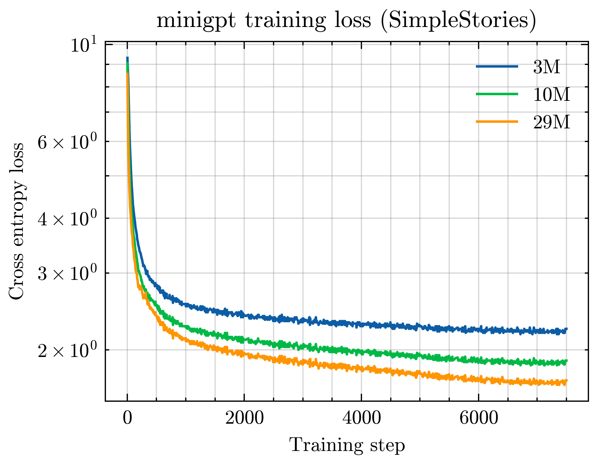

# minigpt

> The secret of life is not just about finding a place but about finding joy in the journey.
>
> — <cite> minigpt (10M) completing the phrase "The secret of life is"</cite>

This repo implements all basic components to train a toy Transformer language model on a single GPU:

- Byte-pair encoding (BPE) tokenization
- Decoder-only Transformer with RoPE [[1]](#1) positional embeddings
- A basic training loop with mixed-precision training and checkpointing
- Sampling/Decoding functions to generate text from a trained LM.

All configurations are stored in `conf/` and read using [hydra](https://hydra.cc/).
Checkpoints trained on SimpleStories [[2]](#2) are available in the [Releases](https://github.com/jongoiko/minigpt/releases/) page.

## Training

The provided default configuration sets up hyperparameters to train a tiny LM ([~10M parameters](#model-sizes)) on SimpleStories, a text dataset that is similar in spirit to TinyStories [[3]](#3) but provides more varied data.

### Downloading the dataset

The script `get_simplestories.py` pulls the dataset training split from HuggingFace, separating it into training and validation sets.
It is strongly recommended to run it with [uv](https://docs.astral.sh/uv/) to automatically install all dependencies:

```shell
uv run get_simplestories.py
```

This will write the train/validation corpora to the paths specified in the top-level config (`train_corpus_path` / `val_corpus_path`).

### Training the LM

We can now run the main training script, which will:

- Train a BPE tokenizer and save the tokenized corpora on disk (see `tokenization` in the configuration);
- Instatiate a Transformer LM (see `model`);
- Train the LM for a specified number of steps (see `training`).
Periodically, the model's loss on the validation set will be evaluated and a checkpoint will be saved.

To start training, simply run

```shell
uv run train.py
```

The training process can be tracked using [TensorBoard](https://www.tensorflow.org/tensorboard).

### Generating text from a trained checkpoint

Once the model has been trained to convergence, we can use it to generate text by sampling tokens autoregressively, optionally from a starting prompt.
See the `generate_text.ipynb` notebook for some examples.

### Exporting to TF SavedModel

Model checkpoints can be exported to the [TensorFlow SavedModel](https://www.tensorflow.org/guide/saved_model) format:

```shell
uv run export_to_tf.py
```

See the `exporting` configuration to change the checkpoint / output path.

### Training on TinyStories

Just overwrite the training and validation corpora:

```shell
wget -O data/train.txt https://huggingface.co/datasets/roneneldan/TinyStories/resolve/main/TinyStoriesV2-GPT4-train.txt
wget -O data/valid.txt https://huggingface.co/datasets/roneneldan/TinyStories/resolve/main/TinyStoriesV2-GPT4-valid.txt
```

If a training run was previously started with another dataset, it is necessary to remove the tokenizer and encoded data to re-train the BPE tokenizer:

```shell
rm tokenizer.pkl
rm -r data/tokenized/
uv run train.py # Start a new training run from scratch
```

## Transformer architecture

The implemented model applies the following modifications to the original Transformer [[4]](#4):

- Rotary Position Embeddings (RoPE) [[1]](#1);
- The usage of RMSNorm [[5]](#5) instead of LayerNorm;
- Applying normalization _before_ the attention and feed-forward blocks (_pre-norm_) rather than after;
- SwiGLU [[6]](#6) feed-forward networks instead of ReLU MLPs;
- Untied input and output embeddings.

### Model sizes

In `conf/model`, three model architectures are specified.
A pre-trained checkpoint for each model size is provided in the [Releases](https://github.com/jongoiko/minigpt/releases/) page.

| Model name | Total parameter count | n_layers | d_model | d_ff | n_heads | n_ctx | d_vocab |
|------------|-----------------------|----------|---------|------|---------|-------|---------|
| 3M         | 3,413,120             | 4        | 128     | 384  | 4       | 256   | 10,000  |
| 10M        | 9,940,224             | 6        | 256     | 704  | 4       | 256   | 10,000  |
| 29M        | 28,924,416            | 6        | 512     | 1344 | 16      | 256   | 10,000  |

Training curves for each of the three model sizes are shown below.

<p align="center">
    
</p>

## Resources and references

- [CS336 Language Modeling from Scratch (Stanford)](https://stanford-cs336.github.io/spring2025/)
- [The Illustrated Transformer](https://jalammar.github.io/illustrated-transformer/) by Jay Alammar

<a id="1">[1]</a>
Su, Jianlin, et al. "Roformer: Enhanced transformer with rotary position embedding." Neurocomputing 568 (2024): 127063.

<a id="2">[2]</a>
Finke, Lennart, et al. "Parameterized Synthetic Text Generation with SimpleStories." arXiv preprint arXiv:2504.09184 (2025).

<a id="3">[3]</a>
Eldan, Ronen, and Yuanzhi Li. "Tinystories: How small can language models be and still speak coherent english?." arXiv preprint arXiv:2305.07759 (2023).

<a id="4">[4]</a>
Vaswani, Ashish, et al. "Attention is all you need." Advances in neural information processing systems 30 (2017).

<a id="5">[5]</a>
Zhang, Biao, and Rico Sennrich. "Root mean square layer normalization." Advances in neural information processing systems 32 (2019).

<a id="6">[6]</a>
Shazeer, Noam. "Glu variants improve transformer." arXiv preprint arXiv:2002.05202 (2020).
