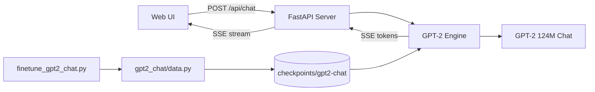

# Hessi-GPT

**An end-to-end chat language model — fine-tuning, inference, and a live streaming UI.**

[](https://github.com/HessiKz/)
[](https://www.python.org/)
[](https://pytorch.org/)
[](https://fastapi.tiangolo.com/)
[](LICENSE)

> **Portfolio summary:** Built a full-stack LLM chat application on GPT-2 124M — from dataset prep and fine-tuning through a FastAPI streaming backend and a custom real-time inference UI with pipeline telemetry.

---

## Overview

**Hessi-GPT** is a personal language-model project that goes beyond loading a pretrained checkpoint. It includes:

- **Chat fine-tuning** of OpenAI GPT-2 (124M) on conversational data
- **Streaming inference** with top-p sampling and multi-turn memory
- **FastAPI backend** exposing Server-Sent Events (SSE) for token-by-token output
- **Custom web UI** with live pipeline state, architecture specs, and token telemetry

The project started from a small JAX transformer codebase and was extended into a production-style chat stack using PyTorch and Hugging Face Transformers.

---

## What I Built

| Layer | Description |
|-------|-------------|
| **Fine-tuning pipeline** | Dataset loading, chat formatting (`User:` / `Assistant:`), Hugging Face `Trainer` loop |
| **Inference engine** | GPT-2 load/generate with streaming, stop sequences, and conversation history |
| **API server** | FastAPI + SSE at `/api/chat`, health and architecture endpoints |
| **Frontend** | Industrial-brutalist chat terminal with live pipeline phases and per-token metrics |
| **CLI** | `generate.py` for quick local testing without the UI |

---

## Architecture



**Model:** GPT-2 124M · 12 layers · 768 d_model · 1024 context · BPE tokenizer  
**Decoding:** Top-p (nucleus) sampling · repetition penalty · multi-turn prompt formatting

---

## Tech Stack

**ML / NLP:** PyTorch, Hugging Face Transformers, Datasets, Accelerate  
**Backend:** FastAPI, Uvicorn, Pydantic, SSE streaming  
**Frontend:** Vanilla HTML/CSS/JS (no framework)  
**Original codebase:** JAX/Equinox transformer (training & research path retained)

---

## Quick Start

### 1. Clone and install

```bash
git clone https://github.com/HessiKz/Hessi-GPT.git
cd Hessi-GPT
python -m venv .venv
source .venv/bin/activate
pip install torch transformers datasets accelerate fastapi uvicorn pydantic
```

### 2. Fine-tune the chat model

Training downloads base `gpt2` from Hugging Face and saves a chat checkpoint locally (~500 MB).

```bash
CUDA_VISIBLE_DEVICES="" python finetune_gpt2_chat.py --max-steps 60
```

Checkpoint output: `checkpoints/gpt2-chat/`

> **Note:** Model weights are not committed to this repo (size limits). Run the fine-tune step above to generate them locally.

### 3. Chat from the CLI

```bash
python generate.py --prompt "Hello! How are you?" --max-tokens 80
```

### 4. Launch the web UI

```bash
./run_ui.sh
```

Open **http://127.0.0.1:8765**

The UI streams tokens in real time and shows pipeline phases: encode → decode → emit.

---

## API

| Endpoint | Method | Description |
|----------|--------|-------------|
| `/` | GET | Chat UI |
| `/api/health` | GET | Server and model status |
| `/api/architecture` | GET | Model spec and pipeline steps |
| `/api/chat` | POST | SSE streaming chat (`prompt`, `max_tokens`) |

**Example:**

```bash
curl -N -X POST http://127.0.0.1:8765/api/chat \
  -H "Content-Type: application/json" \
  -d '{"prompt":"Hello!","max_tokens":40}'
```

---

## Project Structure

```
Hessi-GPT/
├── finetune_gpt2_chat.py   # Chat fine-tuning entry point
├── generate.py             # CLI chat inference
├── engine.py               # GPT-2 streaming inference engine
├── server.py               # FastAPI + SSE server
├── run_ui.sh               # Start the chat UI
├── gpt2_chat/
│   ├── config.py           # Training & generation hyperparameters
│   ├── data.py             # Dataset loading and tokenization
│   └── formatting.py       # Chat prompt templates
├── web/                    # Chat UI (HTML, CSS, JS)
└── src/minigpt/            # Original JAX transformer (training path)
```

---

## Skills Demonstrated

- **LLM fine-tuning** — instruction-style chat formatting, causal LM training, checkpoint management
- **Real-time inference** — threaded streaming generation, stop sequences, conversation state
- **Backend engineering** — REST + SSE APIs, async request handling, model warm-up on startup
- **Frontend UX** — streaming text rendering, live telemetry, accessible dark UI
- **ML systems** — CPU/GPU device handling, memory-conscious deployment considerations

---

## Resume Bullet (copy-paste)

> Built **Hessi-GPT**, a full-stack chat LLM app: fine-tuned GPT-2 124M on conversational data, deployed a FastAPI SSE streaming backend, and shipped a custom real-time inference UI with pipeline telemetry — Python, PyTorch, Transformers, FastAPI.

---

## Credits & Lineage

| | |
|---|---|
| **Author** | [HessiKz](https://github.com/HessiKz/) |
| **Base transformer code** | Forked and extended from [jongoiko/minigpt](https://github.com/jongoiko/minigpt) |
| **Chat model base** | [OpenAI GPT-2](https://huggingface.co/gpt2) via Hugging Face |
| **License** | MIT — see [LICENSE](LICENSE) |

See [CREDITS.md](CREDITS.md) for full attribution.

---

## Roadmap

- [ ] Docker + Hugging Face Spaces deployment
- [ ] 8-bit quantization for lighter hosting
- [ ] Larger dialog dataset for improved reply quality
- [ ] Optional GPU inference path

---

**© 2025 [HessiKz](https://github.com/HessiKz/)**
